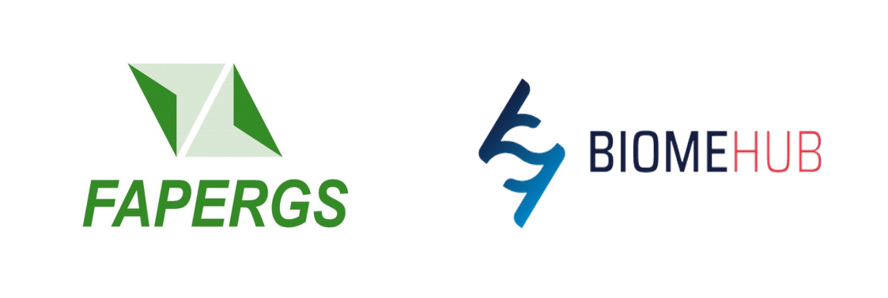

# NESS

NESS (Neural Sequence Search) is an alignment-free tool for sequence search based on word embedding an approximate nearest neighbor (ANN) search. The tool is still under development and the code present in this repository is a proof of concept distributed under the GPL v3 license. 

## Installation

```
$ pip install ness-search
```

## Try on Google Colab!

Try NESS on this [Google Colab notebook](https://colab.research.google.com/github/omixlab/ness/blob/main/notebooks/NESS%20Colab%20Tutorial.ipynb).

## Usage

Currently the NESS CLI interface provides the following commands:

### `ness build_model`

Creates a Word2Vec model from a multi FASTA file. For DNA sequences, use `--both-strands`.

```
$ ness build_model \
    --input swissprot.fasta \
    --output swissprot.model
```

### `ness build_database`

Similarly to `makeblastdb`, formats a sequence database with vectors computed using a
model previously built. For DNA sequences, use `--both-strands`.

```
$ ness build_database \
    --input swissprot.fasta \
    --model swissprot.model \
    --output swissprot.csv
```

### `ness search`

Similarly to the `blast*` programs, compares a multi  FASTA file with the previously formated database.

```
$ ness search \
    --input sequences.fasta \
    --database swissprot \
    --output hits.csv
```

# Cite

Kremer, FS *et al* (2021). *NESS: an word embedding-based tool for alignment-free sequence search*. Available at: https://github.com/omixlab/ness. 

# Acknownledgements

NESS was supported by grants from [Fundação de Amparo à Pesquisa do Estado do Rio Grande do Sul (FAPERGS)](https://fapergs.rs.gov.br/inicial) and is developed in partership with [BiomeHub](https://www.biome-hub.com/).

